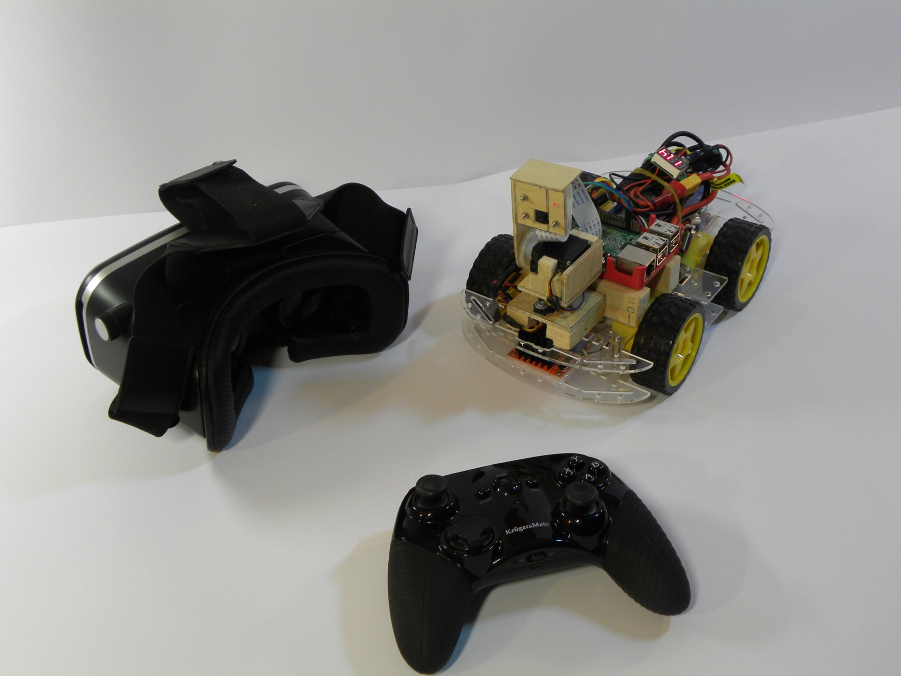
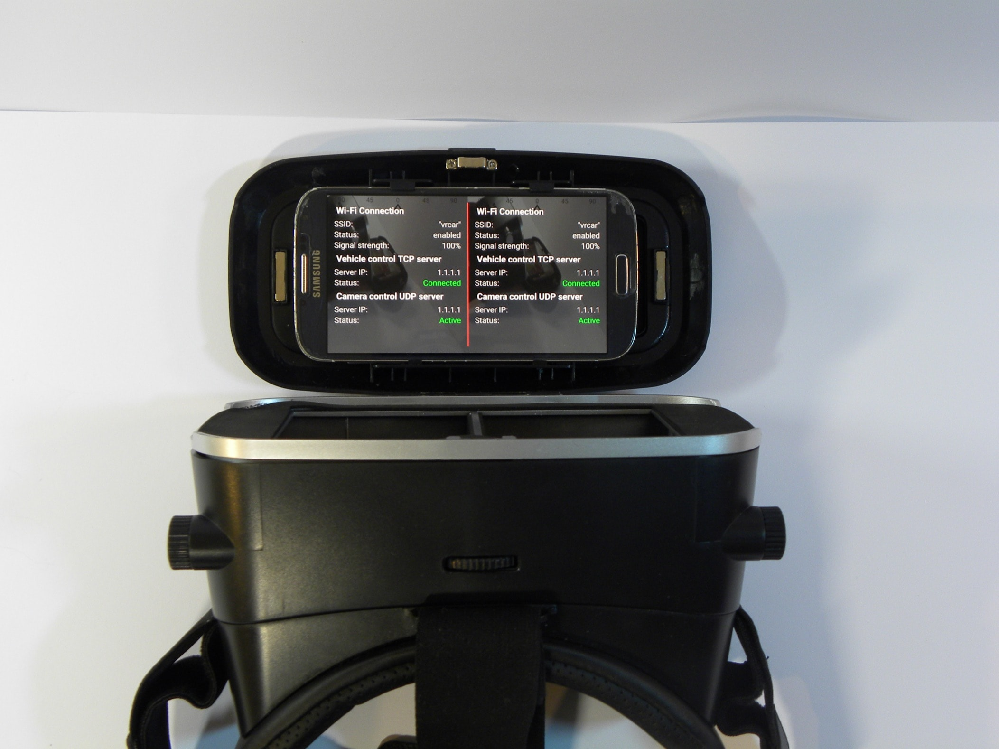
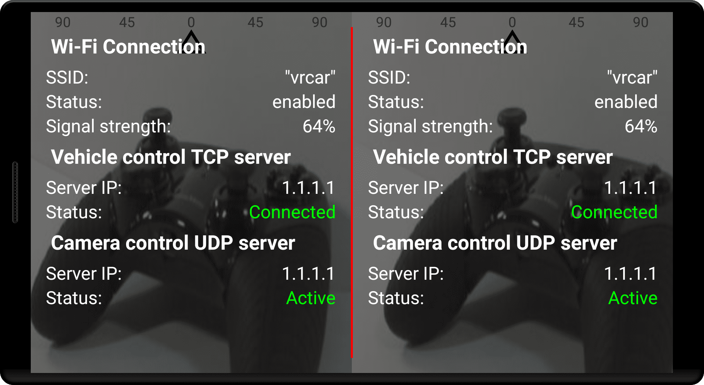
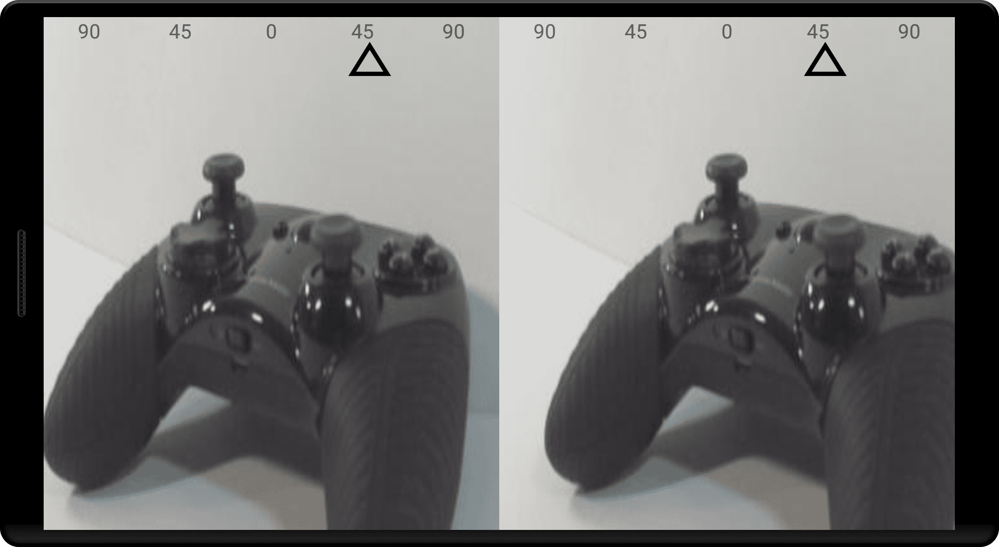
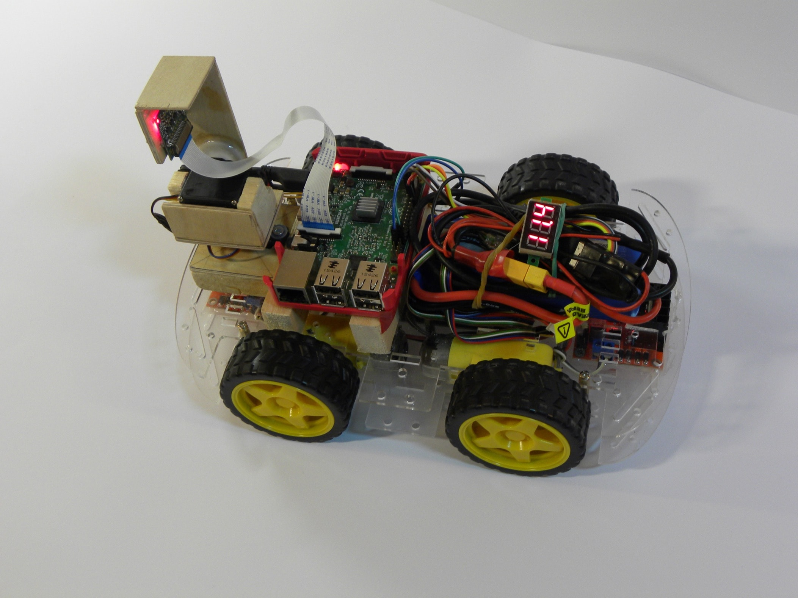
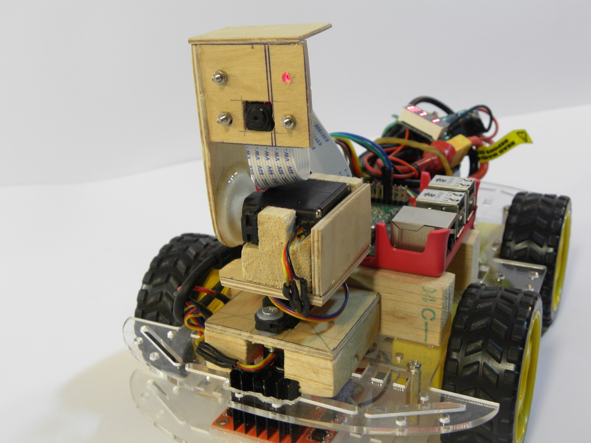
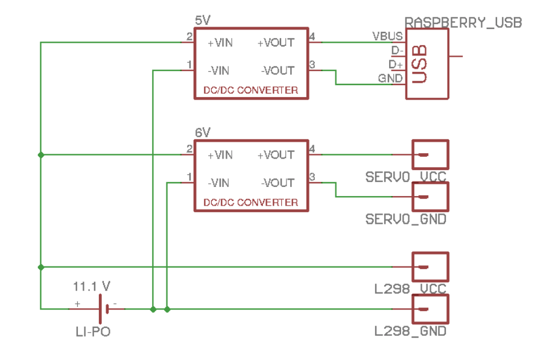

# CameraCarVR

<div align="middle" >


</div>

CameraCarVR is four wheel vehicle with moveable camera controlled remotely by android application, gamepad and VR googles. Vehicle camera in realtime follows controller's head movement by mirroring current horizontal and vertical phone declination. Installed Raspberry Pi 3 computer is responsible for controlling vehicle and streaming camera preview directly to Android device through Wi-Fi connection. Camera preview is displayed as a stereoscopic image, so using VR goggle controller can easily step into virtual reality. In order to boost control precision, Android device is paired with classic gamepad controller by Bluetooth wireless technology.

Whole project can be divided into 3 parts:
* Android application ([Android](https://github.com/thirteendollars/cameracar-android))
* Raspberry software ([Software](https://github.com/thirteendollars/cameracar-raspberry))
* Hardware

## Android application
<div align="middle" >


</div>
Android application allows us to control vehicle remotly using Wi-Fi connection. All the necessary information about connection is displayed as hideable transparent menu. In the top of the screen graphical indicator shows current horizontal declination of camera. Bluetooth/USB gamepad is obligatory to controll vehicle, because no graphic controller is provided.

## Raspberry software
<div align="middle" >


</div>
Theare are 3 independent server application set on it:

1) Camera movement server
Simple UDP server implemented in C language, responsible for receiving data from android application in order to control camera position through GPIO pins. Communication with GPIO pins are served by [WiringPi](http://wiringpi.com/) 

2) Vehicle movement server
Simple TCP server implemented in C language, responsible for receiving data from android application in order to control electric motors speed (with help of L298N motor conroller) through GPIO pins. Communication with GPIO pins are served by [WiringPi](http://wiringpi.com/) 

3) Camera stream server
[RPi_Cam_Web_Interface](https://github.com/silvanmelchior/RPi_Cam_Web_Interface) open-source application is responsible for streaming video from Raspberry camera. [PiViewer](https://github.com/patcat/PiView) application helps convert classic camera preview into stereoscopic one.

## Hardware

Raspberry Pi 3 with [Raspbian OS](https://www.raspberrypi.org/downloads/raspbian/) and 3 server applications installed, works as a main vehicle controller. Four electric motors are controlled by two L298N modules. Camera motion is possible by two Hitec HS-81MG servos installed on vehicle. Power is provided by 3C 11,1V Li-Po accumulator.



## Extra information
To clone whole project at once use recursive mode:
```
git clone --recursive git://github.com/thirteendollars/CameraCarVR.git
```
